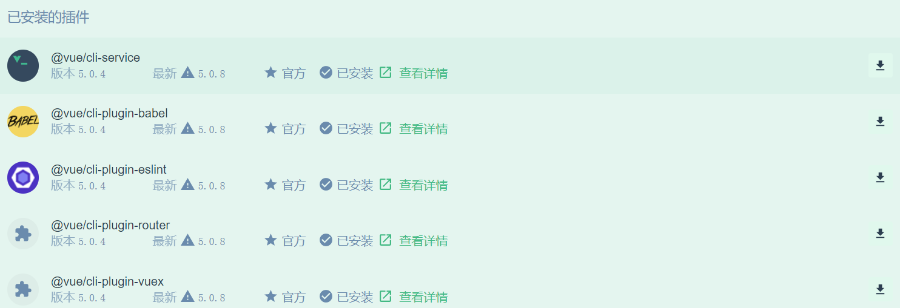

## MySpace

### 环境配置

[Vue官网](https://vuejs.org/)

[Nodejs](https://nodejs.org/en/)

16.16.0 LTS

**图形化界面**

```bash
# 安装@vue/cli
npm i -g @vue/cli
# 启动图形化界面
vue ui
```

**插件**



### 命令行

```bash
npm install
# 运行
npm run serve
# 打包
npm run build
```

### 运行依赖

+ bootstrap
+ jquery
+ jwt-decode
+ vue-router
+ vuex

```javascript
npm i jquery
npm i jwt-decode
```

### 功能

+ 网站整体布局
+ 用户动态页面

登录用户名：123，密码：123

已注册用户名：Pcjmy，密码：12345678

### 实现页面

+ 首页
+ 好友列表
+ 好友动态
+ 登录
+ 注册
+ 404

### 遇到的问题

```shell
1.切换用户个人信息没有更新
解决办法：<router-view :key="$route.fullPath"/>

2.[vuex] unknown action type
解决办法：函数写在actions和modules之间，没有写在actions里面

3.Invalid route component at extractComponentsGuards
解决办法：vue-router中component后的组件名不加引号
```

